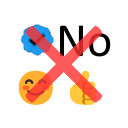

# Twitter No Spam

Twitter(X)のスパムコメントを排除、厳密には認証済みかつアカウント名に日本語が含まれていないものを非表示にします。  
また、URL や絵文字のみのリプライも非表示になるほか、単語で自動的に非表示にする機能もあります

## スクリーンショット

## 公開リンク

[Chrome Web ストア](https://chromewebstore.google.com/detail/twitter-no-spam/pohkfjndbakfgfaffloiecnfkaaggdbh?hl=ja)

## History

### 1.3.0

- ブラックリスト機能、ブラックワード機能を追加
- オプション画面 UI 改修
- URL または絵文字のみのリプライを自動非表示
- リプライページに加えて、検索ページに対応

### 1.2.0

- ホワイトリスト機能、非表示アカウントの詳細の表示/非表示機能を追加

### 1.1.0

- オプション画面実装

### 1.0.0

- プラグイン公開
- リプライで認証アカウントかつアカウント名に日本語がないアカウントを非表示
